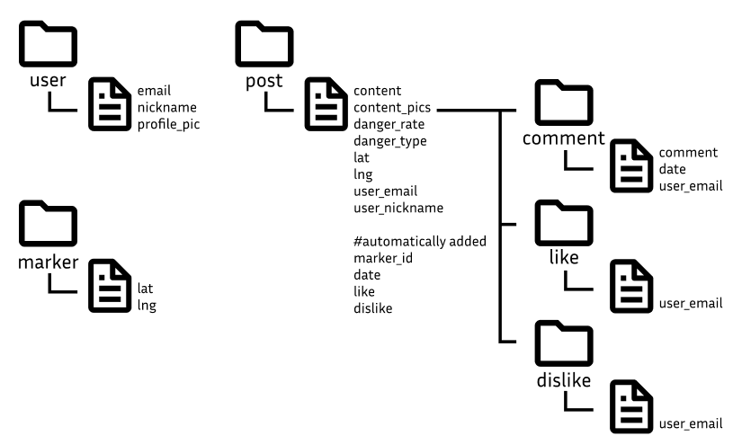

# 개발환경
### python
- python==3.7.13
### pip list
- django==3.2.23
- djangorestframework==3.13.1
- --upgrade firebase-admin

# 커밋
- 커밋은 파일 단위로
- 모든 파일 커밋 완료 시\
루트 파일 git add 한 다음 git commit -m "Edit 날짜"로 제출

# URL
- 모든 URL의 출처는 `http://127.0.0.1:8000/`임

|URL|HTTP Method|기능|추가|
|---|-----------|----|----|
|`users`|GET|모든 유저 리스트를 가져온다|
|`users/<user_email>`|GET|해당 이메일을 가진 유저를 가져온다|해당 프로젝트에선 이메일이 pk로 쓰임|
|`users/profile-pic/<str:pk>/<str:url>`|PATCH, DELETE|해당 이메일의 유저 프로필 사진 수정 및 삭제
|`posts`|GET, POST|모든 게시물 리스트를 가져온다|
|`posts/<post_title>`|GET|해당 제목을 가진 모든 게시물을 가져온다|아직 중복된 제목에 대한 처리구현 X
|`posts/email/?user_email={user_email}`|GET|해당 이메일로 작성된 모든 게시글을 가져온다.
|`posts/like/?date={date}`|GET, POST|작성날짜를 기준으로 게시글을 가져와 좋아요를 누른 사람을 조회하고, 좋아요를 추가할 수 있다.
|`posts/dislike/?date={date}`|GET, POST|작성날짜를 기준으로 싫어요를 누른 사람을 조회하고, 싫어요를 추가할 수 있다.
|`posts/comment/?date={date}`|GET, POST|작성날짜를 기준으로 댓글들을 조회하고, 댓글을 추가할 수 있다.|


# 추가 및 수정해야 할 기능들
- firestore 보안 규칙 재설정
- 로그인 기능
- 구글 맵
- 위치정보를 나타내는 필드 추가 : 경도, 위도, 위험정보
- storage 연동

# 수정 사항
1. 24.01.13 : 기본 세팅 및 serializer 생성
2. 24.01.19 : firebase연동, 데이터 모델 생성, post와 user 간단한 GET, POST 기능 추가
3. 24.01.24 : django-allauth 관련 코드 삭제, cors에러 처리

# 데이터 모델

date, like, dislike필드는 자동으로 설정되나, date필드는 형식에 맞춰 입력은 해야 함.

# 초기 설정
```shell
pyenv install 3.7.13 # 파이썬 설치
pyenv virtualenv 3.7.13 danger-map # danger-map 이름의 가상환경 생성

# danger_map 프로젝트 루트 폴더로 이동한 후 가상환경 적용
pyenv local danger-map
pip install django==3.2.23 djangorestframework==3.13.1
pip install --upgrade firebase-admin
pip install django-cors-headers
pip install pytz    # 설치 보류
```
### 1. `adminsdk.json` 파일을 루트 디렉토리에 넣는다.(manage.py가 있는 디렉토리)
### 2. `python manage.py runserver` 를 통해 서버를 연 후, 필요에 따라 위의 url들을 이용한다.

#### post데이터 추가 시 주의사항
    {
        "user_email": "ex01@gmail.com",
        "date": "2024-02-13T22:53:17.298000Z",
        "content": "content01",
        "content_pics": ["pic_url/pic_url01", "pic_url/pic_url02"],
        "user_nickname": "ex01",
        "danger_type": "ice",
        "lat": 53.42,
        "lng": -32.112,
        "location": "홍문관 앞",
        "danger_rate": 50
    }
위의 형식으로 POST하도록 한다.
- date 필드 : 현재시간으로 대체되지만 timestamp형식에 맞는 값을 넣어야 한다.
- like, dislike 필드 : GET요청을 통해 정보를 가져올 때마다 각각의 컬렉션에 들어있는 문서 개수를 카운트 해서 업데이트 된다.\
또한 `posts/post_title/like`로 이동할 시 별도의 데이터 입력 없이 `POST`만 해도 임의의 데이터가 추가된다.
- danger_rate 필드 : integer필드로 큰따옴표 없이 0~100 사이의 숫자만 넣을 수 있도록 한다.
- lat 필드 : -90 ~ 90 사이의 값
- lng 필드 : -180 ~ 180 사이의 값
